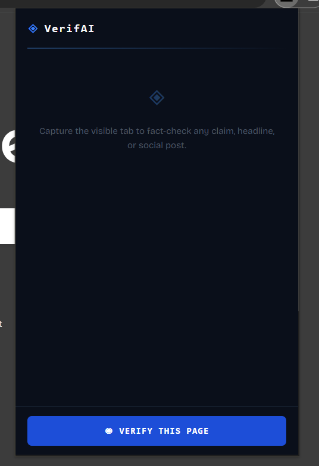
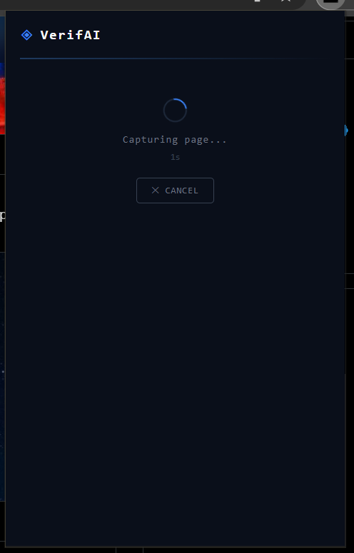

# VerifAI — AI-Powered Fact-Checking Chrome Extension

> **Instantly verify claims on any webpage using AI + live web search.**

---

## What is VerifAI?

VerifAI is a Chrome extension that fact-checks any claim, headline, or social post in real time. Click the extension, hit **Verify This Page**, and within seconds you get a verdict backed by live sources — powered by **Google Gemini 2.5 Flash** and **Tavily Search**.

No more manually Googling headlines. No more falling for misinformation.

---

## Screenshots

<table align="center">
  <tr>
    <td align="center" valign="top"><br/><sub><b>Home</b></sub></td>
    <td align="center" valign="top"><br/><sub><b>Capturing</b></sub></td>
    <td align="center" valign="top"><br/><sub><b>Result</b></sub></td>
  </tr>
</table>

---

## How It Works

1. **Screenshot** — captures the visible tab as a JPEG
2. **Extract** — Gemini 2.5 Flash identifies the core claim from the image
3. **Search** — Tavily searches the live web for relevant evidence (6 sources)
4. **Verify** — Gemini cross-references the claim against the evidence
5. **Verdict** — returns `VERIFIED` or `MISINFORMATION` with confidence score, summary, and detailed analysis

---

## Features

- 🔍 **One-click fact-checking** — works on any webpage, article, or social post
- 🤖 **Gemini 2.5 Flash** — extracts claims and verifies against real evidence
- 🌐 **Live web search** — Tavily finds real-time sources, not cached data
- ✅ **Clear verdicts** — VERIFIED / MISINFORMATION with confidence score
- 📋 **Detailed analysis** — full reasoning with numbered source citations [1], [2], [3]
- ⏱️ **Progress indicators** — live timer + status messages so it never feels frozen
- ❌ **Cancel anytime** — cancel mid-analysis or go back with one click
- 🕒 **History** — last 50 verifications saved locally

---

## Tech Stack

| Layer | Technology |
|---|---|
| Extension UI | React + TypeScript + Vite |
| Backend | Cloudflare Workers (Hono) |
| AI Model | Google Gemini 2.5 Flash |
| Web Search | Tavily Search API |
| Package Manager | pnpm |

---

## Project Structure

```
VerifAI/
├── extension/                  # Chrome extension
│   ├── src/
│   │   ├── popup/              # React UI (Popup.tsx)
│   │   ├── background/         # Service worker (background.ts)
│   │   ├── api.ts              # API calls
│   │   └── types.ts            # Shared TypeScript types
│   ├── manifest.json
│   └── vite.config.ts
│
└── backend/                    # Cloudflare Workers API
    ├── src/
    │   └── index.ts            # Hono app — Gemini + Tavily logic
    └── wrangler.toml
```

---

## Getting Started

### Prerequisites

- Node.js 18+
- pnpm
- A Cloudflare account
- Google Gemini API key
- Tavily API key

### 1. Clone the repo

```bash
git clone https://github.com/cryosleeperX20/VerifAI.git
cd VerifAI
```

### 2. Set up the backend

```bash
cd backend
pnpm install
```

Create a `.dev.vars` file inside `backend/`:

```
GOOGLE_API_KEY=your_gemini_api_key_here
TAVILY_API_KEY=your_tavily_api_key_here
```

Start the local backend:

```bash
pnpm dev
```

You should see: `Ready on http://127.0.0.1:8787`

### 3. Build the extension

```bash
cd ../extension
pnpm install
pnpm build
```

### 4. Load in Chrome

1. Go to `chrome://extensions`
2. Enable **Developer mode** (top right toggle)
3. Click **Load unpacked**
4. Select the `extension/dist` folder

---

## Usage

1. Navigate to any webpage with a news article, headline, or social post
2. Click the **VerifAI** icon in your Chrome toolbar
3. Hit **◉ VERIFY THIS PAGE**
4. Wait 20–35 seconds while VerifAI captures, searches, and analyzes
5. Read the verdict, summary, and detailed analysis with sources

---

## API Keys — All Free Tier

| Service | Get Key |
|---|---|
| Google Gemini | [aistudio.google.com](https://aistudio.google.com) |
| Tavily Search | [tavily.com](https://tavily.com) |
| Cloudflare Workers | [cloudflare.com](https://cloudflare.com) |

---

## Deployment to Cloudflare

```bash
cd backend
wrangler secret put GOOGLE_API_KEY
wrangler secret put TAVILY_API_KEY
wrangler deploy
```

Then update `API_BASE_URL` in `extension/src/api.ts` and `background.ts` to point to your deployed worker URL.

---

## Contributing

Pull requests are welcome! For major changes, please open an issue first.

---

## License

[MIT](LICENSE)

---

<p align="center">Built to fight misinformation, one claim at a time.</p>
